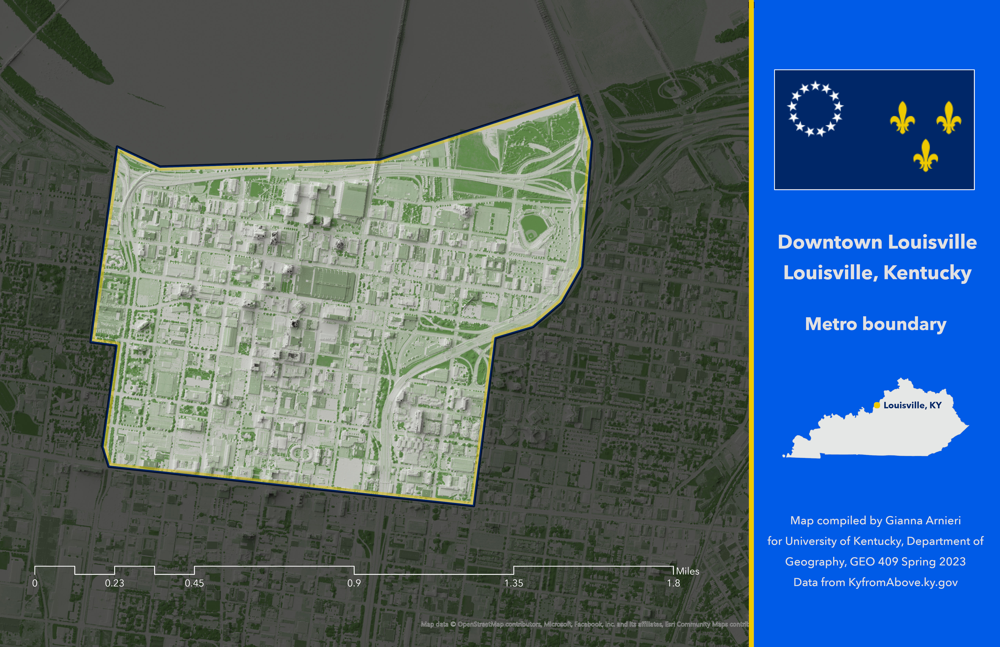

# Downtown Louisville boundary map
## Louisville Metro, Kentucky 

Outlined map of downtown Louisville, KY with contextual state map. Overlaid NDVI data shows vegetation on 3D shaded relief. 

This repository page can be accessed at the following URL: https://{garnieri}.github.io/{lville-metro}/

     
*Downtown Louisville boundary map, Louisville KY*

[Link to high-resolution version](Layout.pdf)     

Published Thursday, April 13, 2023 by Gianna Arnieri.
Map compiled by Gianna Arnieri for University of Kentucky, Department of Geography, GEO 409 Spring 2023
Data from KyfromAbove.ky.gov
